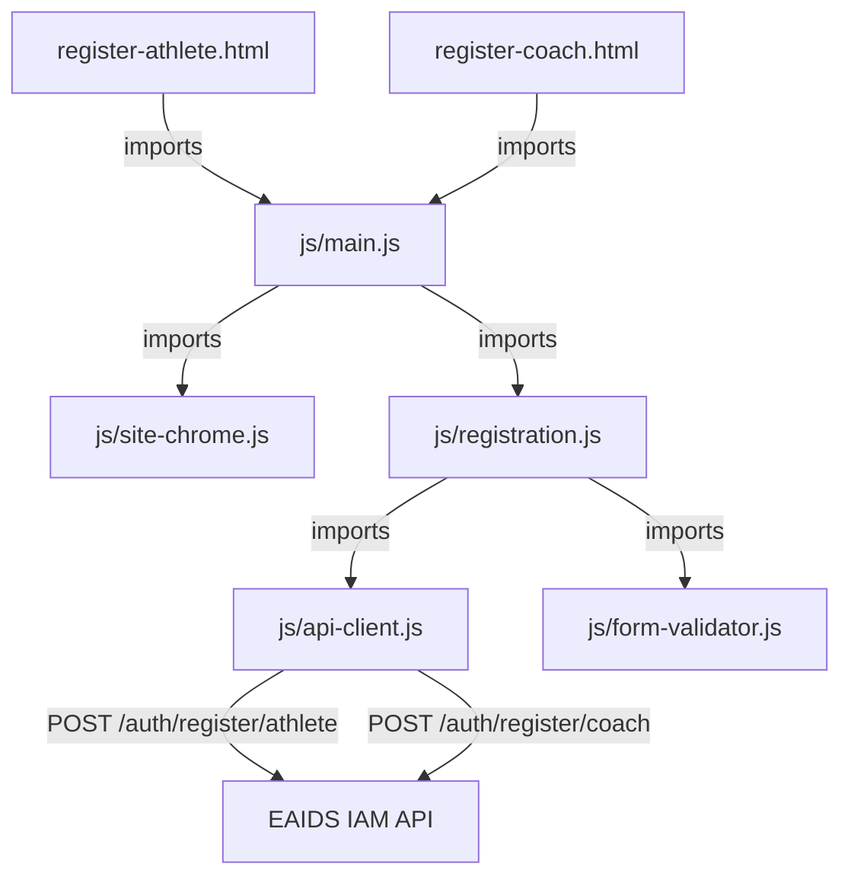

# Design Document: Registration Forms

## Overview

This design covers the implementation of athlete and coach registration pages for the AFEDEV website. The feature adds two new HTML pages (`register-athlete.html`, `register-coach.html`) that collect user credentials and submit them to the EAIDS IAM backend API. The implementation follows the established multipage static site architecture with Bootstrap 5, custom dark theme CSS, and vanilla JavaScript ES modules bundled by Vite.

The registration flow is intentionally simple: collect email, phone number, password, and password confirmation, validate client-side, then POST to the appropriate API endpoint. On success, the user sees a confirmation message. On failure, field-level or general errors are displayed inline.

## Architecture



### Key Design Decisions

1. **Shared registration module**: Both pages use the same `js/registration.js` module parameterized by role (`athlete` or `coach`). This avoids code duplication since the forms are identical except for the API endpoint and page title.

2. **Separate API client module**: `js/api-client.js` encapsulates fetch logic, timeout handling (AbortController), and response parsing. This keeps HTTP concerns isolated and reusable for future API integrations (login, profile completion).

3. **Separate form validator module**: `js/form-validator.js` contains pure validation functions (email format, password rules, password match). Pure functions are easier to test and reason about.

4. **No external JS dependencies**: The implementation uses only the Fetch API, AbortController, and Bootstrap's CSS classes for validation states. No form libraries or HTTP clients are added.

5. **Navigation as dropdown**: Registration links are added as a "Register" dropdown in the nav to avoid cluttering the top-level navigation while providing easy discoverability.

## Components and Interfaces

### HTML Pages

#### `register-athlete.html` / `register-coach.html`

Standalone HTML pages following the project pattern (see `index.html`):
- `data-page="register-athlete"` or `data-page="register-coach"` on `<body>`
- Skip-to-content link → `<main id="main">`
- `<div id="site-header"></div>` and `<div id="site-footer"></div>` placeholders
- Breadcrumb nav (`Home > Athlete/Coach Registration`)
- Page hero section with title and description
- Registration form inside a `.form-card` container
- Link to the alternate registration page
- Success alert container (hidden by default, `aria-live="polite"`)
- General error alert container (hidden by default, `aria-live="polite"`)
- Bootstrap 5.3.3 JS bundle (CDN) + `js/main.js` as module

### JavaScript Modules

#### `js/form-validator.js`

Exports pure validation functions:

```javascript
/**
 * Validates an email string.
 * @param {string} email
 * @returns {{ valid: boolean, message: string }}
 */
export function validateEmail(email)

/**
 * Validates a password against the Password_Rules.
 * @param {string} password
 * @returns {{ valid: boolean, message: string }}
 */
export function validatePassword(password)

/**
 * Checks that password and confirmPassword match.
 * @param {string} password
 * @param {string} confirmPassword
 * @returns {{ valid: boolean, message: string }}
 */
export function validatePasswordMatch(password, confirmPassword)

/**
 * Validates all form fields. Returns a map of field name → error message.
 * Empty map means all fields are valid.
 * @param {{ email: string, phoneNumber: string, password: string, confirmPassword: string }} fields
 * @returns {Map<string, string>}
 */
export function validateRegistrationForm(fields)
```

#### `js/api-client.js`

Encapsulates HTTP communication:

```javascript
/**
 * @typedef {Object} ApiSuccess
 * @property {string} id
 * @property {string} email
 * @property {string} role
 * @property {string} status
 */

/**
 * @typedef {Object} ApiFieldError
 * @property {string} field
 * @property {string} message
 */

/**
 * @typedef {Object} ApiError
 * @property {string} timestamp
 * @property {number} status
 * @property {string} message
 * @property {ApiFieldError[]|null} errors
 */

/**
 * @typedef {Object} ApiResponse
 * @property {boolean} ok
 * @property {ApiSuccess|null} data
 * @property {ApiError|null} error
 * @property {'timeout'|'network'|'api'|null} errorType
 */

const API_BASE = 'http://localhost:8082/api/v1'
const TIMEOUT_MS = 30000

/**
 * Registers a user (athlete or coach).
 * @param {'athlete'|'coach'} role
 * @param {{ email: string, phoneNumber: string, password: string, confirmPassword: string }} payload
 * @returns {Promise<ApiResponse>}
 */
export async function registerUser(role, payload)
```

#### `js/registration.js`

Orchestrates form behavior for both registration pages:

```javascript
/**
 * Initializes registration form behavior for the current page.
 * Determines role from document.body.dataset.page.
 * Attaches submit handler, manages UI states (loading, success, error).
 */
export function initRegistration()
```

Responsibilities:
- Reads role from `data-page` attribute (`register-athlete` → `athlete`, `register-coach` → `coach`)
- On form submit: prevents default, runs `validateRegistrationForm()`, displays validation errors or calls `registerUser()`
- Manages loading state: disables submit button, shows spinner
- On success: hides form, shows success alert
- On error: maps field errors to form fields, shows general errors in alert container
- Clears previous errors on resubmission

#### `js/main.js` (modified)

Adds a call to `initRegistration()` for registration pages:

```javascript
import { initSiteChrome } from './site-chrome.js'
import { initRegistration } from './registration.js'

initSiteChrome()

// ... existing setup functions ...

// Registration page setup
const page = document.body.dataset.page || ''
if (page === 'register-athlete' || page === 'register-coach') {
  initRegistration()
}
```

#### `js/site-chrome.js` (modified)

Adds a "Register" dropdown to `NAV_ITEMS`:

```javascript
{
  id: 'register',
  label: 'Register',
  dropdown: [
    { label: 'Athlete Registration', href: '/register-athlete.html' },
    { label: 'Coach Registration', href: '/register-coach.html' },
  ]
}
```

The `renderNav()` function is updated to handle dropdown items using Bootstrap's dropdown markup.

### CSS Additions (`css/styles.css`)

Minimal additions leveraging existing patterns:
- `.registration-form` — max-width constraint for the form container on large viewports
- `.btn-brand .spinner-border` — spinner sizing inside the submit button
- Reuse existing `.form-card`, `.form-control`, `.form-label`, `.page-hero`, `.breadcrumb-nav` styles

## Data Models

### Form Payload (Client → API)

```typescript
interface RegistrationPayload {
  email: string          // max 254 chars, valid email format
  phoneNumber: string    // tel format, e.g. "+234..."
  password: string       // 8–128 chars, meets Password_Rules
  confirmPassword: string // must match password
}
```

### Success Response (API → Client)

```typescript
interface RegistrationSuccess {
  id: string             // UUID
  email: string
  role: 'ROLE_ATHLETE' | 'ROLE_COACH'
  status: 'PENDING_VERIFICATION'
}
```

### Error Response (API → Client)

```typescript
interface RegistrationError {
  timestamp: string      // ISO 8601
  status: number         // HTTP status code
  message: string        // Human-readable top-level message
  errors: FieldError[] | null
}

interface FieldError {
  field: string          // matches form field name (email, phoneNumber, password, confirmPassword)
  message: string        // Human-readable error for that field
}
```

### Validation Rules (Client-Side)

| Field | Rule | Error Message |
|-------|------|---------------|
| email | Required, valid email format, max 254 chars | "Please enter a valid email address" |
| phoneNumber | Required | "Phone number is required" |
| password | Required, 8–128 chars, ≥1 uppercase, ≥1 lowercase, ≥1 digit, ≥1 special char | "Password must be 8–128 characters with at least one uppercase letter, one lowercase letter, one digit, and one special character" |
| confirmPassword | Required, must match password | "Passwords do not match" |


## Correctness Properties

*A property is a characteristic or behavior that should hold true across all valid executions of a system—essentially, a formal statement about what the system should do. Properties serve as the bridge between human-readable specifications and machine-verifiable correctness guarantees.*

### Property 1: Required field validation completeness

*For any* registration form state where one or more required fields are empty (empty string or whitespace-only), `validateRegistrationForm()` SHALL return an error entry for every empty required field and no error entries for fields that contain valid non-empty values.

**Validates: Requirements 4.1**

### Property 2: Email validation correctness

*For any* string that does not conform to a valid email format (missing `@`, missing domain, invalid characters, exceeds 254 characters), `validateEmail()` SHALL return `{ valid: false }`. *For any* string that conforms to a valid email format and is ≤254 characters, `validateEmail()` SHALL return `{ valid: true }`.

**Validates: Requirements 4.2**

### Property 3: Password rule enforcement

*For any* string that violates at least one Password_Rule (fewer than 8 characters, more than 128 characters, missing uppercase, missing lowercase, missing digit, or missing special character), `validatePassword()` SHALL return `{ valid: false }`. *For any* string that satisfies all Password_Rules, `validatePassword()` SHALL return `{ valid: true }`.

**Validates: Requirements 4.3**

### Property 4: Password match validation

*For any* two strings `a` and `b`, `validatePasswordMatch(a, b)` SHALL return `{ valid: true }` if and only if `a === b`. When `a !== b`, it SHALL return `{ valid: false, message: "Passwords do not match" }`.

**Validates: Requirements 4.4**

### Property 5: API payload fidelity

*For any* role (`athlete` or `coach`) and any valid form input `{ email, phoneNumber, password, confirmPassword }`, calling `registerUser(role, payload)` SHALL produce a fetch request whose JSON body contains exactly those four fields with values identical to the input, and the URL path SHALL end with `/auth/register/{role}`.

**Validates: Requirements 5.3, 6.3**

### Property 6: Error response field mapping

*For any* API error response containing a non-null `errors` array of `{ field, message }` objects, the error display logic SHALL route each error whose `field` value matches a form field name (`email`, `phoneNumber`, `password`, `confirmPassword`) to that field's validation message element, and SHALL route all errors whose `field` value does NOT match any form field name to the general error alert container.

**Validates: Requirements 8.1**

## Error Handling

### Client-Side Validation Errors

| Condition | Behavior |
|-----------|----------|
| Empty required field | Show "This field is required" below the field via `.invalid-feedback` |
| Invalid email format | Show "Please enter a valid email address" below email field |
| Password violates rules | Show full requirements message below password field |
| Passwords don't match | Show "Passwords do not match" below confirm password field |
| Any validation failure | Add `was-validated` to form, prevent API call |

### Network and Timeout Errors

| Condition | Behavior |
|-----------|----------|
| Request timeout (>30s) | Abort via AbortController, show "Unable to connect to the server. Please try again later." |
| Network error (connection refused, DNS failure) | Show "Unable to connect to the server. Please try again later." |
| Both cases | Re-enable submit button, hide spinner |

### API Error Responses

| HTTP Status | Behavior |
|-------------|----------|
| 400 with field errors | Map each field error to its form field; unmapped errors go to general alert |
| 400 without field errors | Show `message` in general alert |
| 409 (Conflict) | Show "This email or phone number is already registered" in general alert |
| 500 (Server Error) | Show "Something went wrong. Please try again later." in general alert |
| Any other unexpected status | Show "Something went wrong. Please try again later." in general alert |
| All error cases | Re-enable submit button, hide spinner, allow resubmission |

### Error Clearing

On every resubmission:
1. Remove all `.invalid-feedback` visible messages
2. Remove `is-invalid` class from all fields
3. Hide the general error alert
4. Remove `was-validated` class from form (re-added after validation runs)

## Testing Strategy

### Test Framework Setup

Since no test framework exists in the project, we'll add **Vitest** (the natural choice for a Vite project) as a dev dependency along with **fast-check** for property-based testing and **jsdom** for DOM testing:

```bash
npm install -D vitest fast-check @vitest/coverage-v8 jsdom
```

Vitest config in `vite.config.ts`:

```typescript
export default defineConfig({
  test: {
    environment: 'jsdom',
  },
  // ... existing build config
})
```

### Property-Based Tests (fast-check)

Each correctness property maps to a single property-based test with minimum 100 iterations:

| Property | Test File | What's Generated |
|----------|-----------|-----------------|
| Property 1: Required field validation | `tests/form-validator.property.test.js` | Random subsets of fields set to empty/whitespace |
| Property 2: Email validation | `tests/form-validator.property.test.js` | Random valid and invalid email strings |
| Property 3: Password rule enforcement | `tests/form-validator.property.test.js` | Random strings violating/satisfying each rule |
| Property 4: Password match | `tests/form-validator.property.test.js` | Random string pairs (matching and non-matching) |
| Property 5: API payload fidelity | `tests/api-client.property.test.js` | Random valid payloads with random role |
| Property 6: Error field mapping | `tests/registration.property.test.js` | Random error arrays with mixed matching/non-matching field names |

**Tag format**: Each test is annotated with:
```javascript
// Feature: registration-forms, Property {N}: {property_text}
```

**Configuration**: All property tests run with `{ numRuns: 100 }` minimum.

### Unit Tests (example-based)

| Area | Test File | Scenarios |
|------|-----------|-----------|
| Form validation edge cases | `tests/form-validator.test.js` | Specific boundary values (exactly 8 chars, 128 chars, empty string) |
| API client success handling | `tests/api-client.test.js` | Mock 201 response parsing |
| API client error handling | `tests/api-client.test.js` | Mock 400, 409, 500 responses; timeout; network error |
| Registration orchestration | `tests/registration.test.js` | Form submit flow, loading state, success display, error display, resubmission clearing |
| Navigation dropdown | `tests/site-chrome.test.js` | Register dropdown renders with both links |

### What's NOT Tested with PBT

- HTML structure (smoke/example tests verify DOM elements exist)
- Responsive layout (manual visual testing)
- Keyboard operability (manual accessibility testing)
- Loading spinner appearance (example-based DOM test)
- aria-live announcements (example-based attribute check)

### Test Commands

```bash
# Run all tests once
npx vitest --run

# Run with coverage
npx vitest --run --coverage
```
